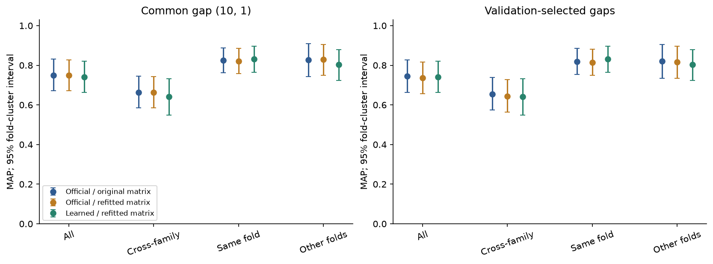
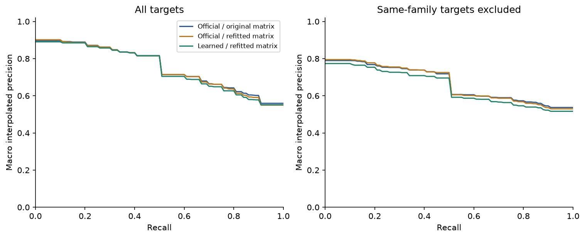

# R1: 어려운 음성을 포함한 고정 평가

이전 세 표현/행렬을 그대로 두고 평가 대상을 바꿨다. 결과를 본 뒤 구조나 설정을 바꾸지 않았다.
공식 모델/공식 행렬도 같은 mini-3di-search에서 평가했으며 Foldseek 실행 파일의 benchmark가 아니다.

## 데이터와 통과 기준

- Train은 이전 256도메인, paired 학습에 실제 참여한 구조는 164개다. 새 학습은 하지 않았다.
- 검색 validation은 이전 test fold b.34/c.26/d.17에서 30 query, 84 target을 구성했다.
  이전 test는 이제 개발 자료이며 독립 test라고 부르지 않는다. 이전 paired validation은
  모델 선택에 이미 사용됐으므로 새 test와의 노출 audit에도 포함했다.
- 새 test는 100 query × 484 target,
  query SF 56개, fold 34개다.
  모든 query에 같은-SF 양성, 같은-fold/다른-SF 음성, 다른-fold 음성을 확보했다.
  다른-family 양성도 최소 하나 있다. PDB·AA·구조 hash와 fold의 분할 겹침은 0이다.
- 314,760개 cross-split/이전 노출 쌍 중 길이 상한상 가능한
  서열 46,906쌍과 TM-align 22,861쌍을 실제 비교했다.
  global identity ≥0.8 & 양쪽 coverage ≥0.9, min(TM1,TM2) ≥0.95의 근접 중복은 0이었다.
  이 기준보다 먼 유사성까지 없음을 보장하지 않는다. TM-align은 원본 알고리즘의 정렬을 사용한다.
- 첫 후보 목록에서 이전 자료와 같은 PDB인 항목을 발견해 **점수 계산 전에** 제외하고 다시
  선정했다. 첫 후보는 `artifacts/followup-preselection-v1`에 남겼다.

공식 공개 목록에 SID와 PDB가 모두 없는 query는 2개(d1q7l.1, d1r8o.1)다.
이 둘의 지표는 JSON의 `published_pdb_absent` 층에 따로 있다. 목록 부재는 배포 가중치의
모든 학습 이력을 확인한 것이 아니므로, 이를 확실한 학습 비노출이나 일반화 검증이라고 부르지 않는다.
이 작은 층만으로 모델 간 결론을 내리지 않는다.

## 결과

공통 gap=(10,1) 결과와 validation에서 고른 gap 결과를 분리했다. MAP는 query 평균,
분모는 반환되지 않은 양성도 포함한다. `cross_family`는 같은-family target을 중립으로 제외한
다른-family 검색이다. `same_fold`는 같은 fold target만 남겨 어려운 음성에 집중한다.
동점은 score 내림차순/ID 오름차순, 동점 순서 기대 AP도 JSON에 보존했다.

| 설정 | 비교군 | gap | MAP 전체 | Recall@10 | MAP 다른 family | MAP 같은 fold | 검색 초 |
|---|---|---|---:|---:|---:|---:|---:|
| common | official_original | 10/1 | 0.7502 | 0.7716 | 0.6636 | 0.8241 | 3.145 |
| common | official_refit | 10/1 | 0.7486 | 0.7771 | 0.6629 | 0.8212 | 3.139 |
| common | learned_refit | 10/1 | 0.7412 | 0.7696 | 0.6412 | 0.8306 | 3.153 |
| selected | official_original | 6/1 | 0.7440 | 0.7649 | 0.6551 | 0.8193 | 3.141 |
| selected | official_refit | 6/1 | 0.7356 | 0.7776 | 0.6437 | 0.8140 | 3.160 |
| selected | learned_refit | 10/1 | 0.7412 | 0.7696 | 0.6412 | 0.8306 | 3.153 |

오차막대는 fold 전체를 2,000회 resample한 query 가중 평균의 95% percentile 구간이다.
fold마다 query 수가 달라도 원래 query 평균을 보존한다. 학습 seed 불확실성은 포함하지 않는다.
PR은 101개 recall 지점의 query별 보간 precision을 평균한 것이며, 그 면적을 MAP라고 하지 않는다.
공통 gap에서도 행렬은 각 알파벳에 맞는 서로 다른 행렬이므로 표현 단독의 인과 효과를 단정하지 않는다.

공통 gap에서 learned−official_refit MAP 차이는 **-0.0074**다. query별 실패 사례,
네 평가 층의 분모와 순위는 [독립 검산 결과](reports/followup-v2/R1-independent-audit.json)에 있다.
AP<0.5 사례는 원인 분석 후보이며 점수만으로 구조 표현의 실패 원인을 확정하지 않는다.
같은 fold를 함께 재추출한 paired 차이의 95% 구간은 [-0.0255, +0.0087]다. 0을 포함하므로 이 표본에서 전체 MAP의 우열을 확정하지 않는다. 분류층별 paired 결과는 R2/final-audit.json에도 보존했다.

낮은 AP의 구체적인 사례:

| 질의 | 재학습 AP | 공식 표현+재추정 행렬 AP | 재학습에서 양성 순위 |
|---|---:|---:|---|
| d1kjqa1 | 0.0240 | 0.0257 | 40, 87 |
| d1iura_ | 0.0410 | 0.0248 | 23, 52 |
| d1st6a5 | 0.0507 | 0.0804 | 19, 41 |

이들은 후보 필터를 쓰지 않은 전수검색 결과다. 따라서 필터의 누락만으로 설명할 수 없다.
예컨대 d1kjqa1의 상위 10개는 모두 다른 fold로 분류된 대상이었다. 표현, 점수 행렬, 구조의
특성 중 어느 것이 원인인지는 이 순위만으로 확정할 수 없어 학습량/행렬 요인 분리가 필요하다.

## 검증·비용

별도 코드가 실제 TSV를 다시 읽어 AP·Recall·대상 제외 규칙·fold bootstrap을 재계산했다.
첫 test 실행은 결과 기록용 hash 함수의 이름 충돌로 지표 저장 전에 중단됐다. 원래 동결 파일과
실패 기록을 보존하고 코드 수정 hash를 별도 연결했다. 데이터·모델·gap·지표 정의는 바꾸지 않았다.
세 반복의 점수/순위가 같고, top-1 경로는 Python 정렬·재채점으로 검사했다. 무효 mask/X를
포함한 인덱스 seed가 없는지도 확인했다. 시간은 warm Numba + top-1 Python traceback이며
인코딩·JIT·디스크 출력은 포함하지 않는다. 동일 gap 조건은 두 설정의 공통 결과로 표시했다.

validation 데이터로 1,000,320,288 DP cell을 계산하는 데 4.617초가
걸렸고, 사전 예측이 CPU 2시간/4GiB 한도 안이었다. 근접 중복 검사 wall time은
665.5초, 평가 프로세스 peak RSS는
195.5MB였다. 이 메모리는 부모 Python 프로세스의
누적 peak이며 컴퓨터 전체나 TM-align child와의 합산 최대치가 아니다. CPU 계산 스레드 1개,
GPU·클라우드·새 대규모 다운로드 없이 수행했다.

## 다음 작업과 재현

R2의 수치 gate(공통 gap MAP 차이 ≤−0.02)는 False다.
R2 학습량·경계 안정성 실험은 R1 test를 보기 전에 `R2_PREREGISTRATION.json`에 조건을
기록했다. 진행 여부는 오류 사례와 이 gate를 함께 확인한다. R3의 필터 처리량은 R1 전수검색만으로
판정하지 않으며 별도 통제 실험이 필요하다. 이후 실행·판단은 FOLLOWUP_PLAN.md와
R2/R3 보고서에서 확인한다.

코드: `experiments/followup/`. 원본 출력: `artifacts/followup-v2/`. 읽을 수 있는 결과:
`reports/followup-v2/`. 순서는 `prepare → similarity → freeze → encode → search validation
→ test 동결 커밋 → search test → audit_results → report`다. 이미 존재하는 출력은 덮어쓰지 않는다.
수치 설정·파일 hash는 [protocol-v2](reports/followup-v2/protocol-v2.json)와
[test freeze](reports/followup-v2/test-freeze.json)를 따른다. 원본 자료를 가진 이 환경에서는
각 모듈을 `.venv-research/bin/python -m experiments.followup.<module>`로 실행한다.
R1 전체를 새 위치에 재생성하려면 `common.OUT`을 별도 경로로 지정한 checkout에서 실행한다.
이 문서는 다른 컴퓨터에서의 전체 재현 검증을 주장하지 않는다.
