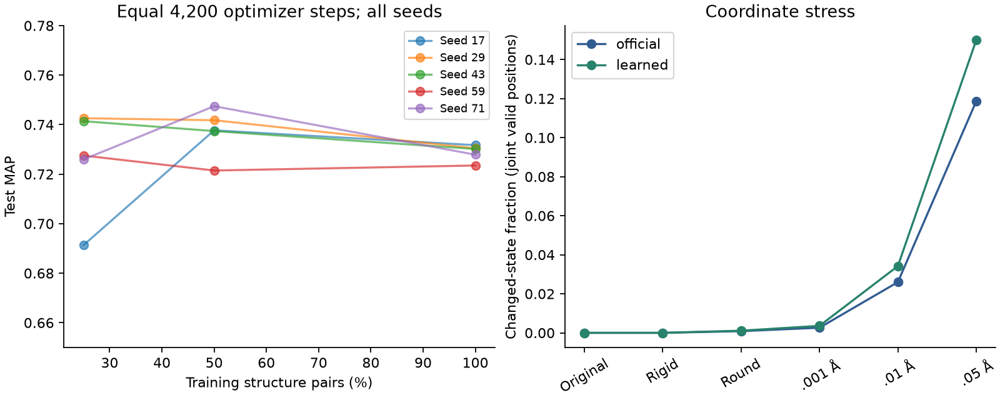

# R2: 학습량과 상태 경계 실험

사전에 정한 15회 학습·검색과 6가지 좌표 조건을 모두 실행했다. 학습량 증가의 효과가
seed마다 같은 방향으로 나타나지 않았으므로 **학습 데이터를 늘리면 개선된다는 결론을 보류한다**.
Soft seed도 validation 보존율 기준을 통과하지 못했다. 기존 배포 모델은 교체하지 않았다.

## 학습량: 모든 초기값을 공개

같은 31 superfamily를 포함하는 중첩 구조 쌍 38/76/152개에서 각각 seed 5개를 학습했다.
실제 directed residue-pair 수는 [data-freeze](reports/followup-v2/R2/data-freeze.json)에 있다.
모든 실행은 Adam 0.001, batch 512, 4,200 step이다. epoch 수가 같은 비교가 아니다.
checkpoint는 원래 paired validation loss의 최솟값으로 선택했다. 새로운 학습 쌍 정렬은
필요하지 않아 기존 152쌍과 정렬 audit를 재사용했다. 학습·모델 선택에 R1 test를 쓰지 않았다.

| 구조 쌍 | validation MAP 평균 | test MAP 평균 | seed 표본 표준편차 |
|---|---:|---:|---:|
| 38 (25%) | 0.6459 | 0.7258 | 0.0207 |
| 76 (50%) | 0.6469 | 0.7372 | 0.0097 |
| 152 (100%) | 0.6355 | 0.7287 | 0.0032 |

각 seed의 full−quarter MAP 차이: 17: +0.0404, 29: -0.0122, 43: -0.0112, 59: -0.0040, 71: +0.0019.
seed 평균·표준편차는 이 5개 초기값의 기술 통계이며 데이터셋 불확실성의 신뢰구간이 아니다.
표현과 **치환 행렬도 같은 비율의 학습 쌍**에서 얻었으므로 이 표로 표현 학습량만의 효과를
분리할 수 없다. 다음 실험에서 두 요인을 분리해야 한다.

primary는 full-data 중 paired loss로 고른 seed **71**,
validation MAP 0.6333, test MAP 0.7279다.
validation 검색 MAP로 고르면 seed 17가 된다.
이 대안 규칙의 비교는 validation에서만 해석하고, test에 맞춰 primary를 바꾸지 않았다.
전체 seed 수치: [TSV](reports/followup-v2/R2/learning-curve.tsv).

## 좌표 변화: 두 가지 불안정성을 구분

질의와 대상 모두에 같은 조건을 적용했다. 강체변환은 한 회전/이동, Gaussian은 구조별로
고정된 독립 원자 잡음이며 강도별로 같은 표준정규 표본을 배율만 바꿨다. 실제 구조 오차의
확률모형이 아니다. 원본 결측 원자는 결측으로 남기고 동일한 기하 규칙으로 처리했다.

| 모델 | 조건 | 상대 변경 | 상대 고정 시 상태 변경 | 3-mer 파괴 | 전수 MAP | 필터 MAP | retain@10 |
|---|---|---:|---:|---:|---:|---:|---:|
| official | unchanged | 0.00% | 0.00% | 0.00% | 0.7502 | 0.7325 | 0.945 |
| learned | unchanged | 0.00% | 0.00% | 0.00% | 0.7279 | 0.7162 | 0.959 |
| official | rigid_float64 | 0.00% | 0.00% | 0.00% | 0.7502 | 0.7325 | 0.945 |
| learned | rigid_float64 | 0.00% | 0.00% | 0.00% | 0.7279 | 0.7162 | 0.959 |
| official | rigid_then_3_decimal_round | 0.15% | 0.02% | 0.25% | 0.7500 | 0.7323 | 0.945 |
| learned | rigid_then_3_decimal_round | 0.15% | 0.02% | 0.33% | 0.7259 | 0.7138 | 0.960 |
| official | gaussian_0.001_A | 0.51% | 0.07% | 0.79% | 0.7499 | 0.7322 | 0.944 |
| learned | gaussian_0.001_A | 0.51% | 0.08% | 1.07% | 0.7255 | 0.7130 | 0.960 |
| official | gaussian_0.01_A | 4.69% | 0.84% | 7.61% | 0.7546 | 0.7337 | 0.957 |
| learned | gaussian_0.01_A | 4.69% | 0.86% | 9.91% | 0.7236 | 0.7141 | 0.967 |
| official | gaussian_0.05_A | 18.81% | 4.44% | 31.28% | 0.7341 | 0.7217 | 0.945 |
| learned | gaussian_0.05_A | 18.81% | 4.28% | 38.25% | 0.7125 | 0.6953 | 0.971 |

상대·상태 변경률은 두 조건 모두 검색에 유효한 위치를 분모로 한다. mask 변경은 별도 JSON에
보존했다. 3-mer는 원본에서 유효했던 창을 분모로, 상태 변경 또는 새 무효 위치가 생기면
파괴로 센다. 두 모델은 강체변환 후 상태·mask·상대가 모두 같았다. 반올림과 잡음에서는
경계 통과가 생겼다. 중심 거리 margin별·구조별 변경 수와 분모도 저장했다.
MAP 변화는 단조롭지 않으며 이 표에서 특정 잡음이 성능을 개선한다고 일반화하지 않는다.

## Soft seed: 실패도 결과

유효한 query 3-mer에서 한 위치에만 두 번째 중심을 허용하고 positional hit는 중복 제거했다.
변경은 후보 검색에만 적용하며 정렬 점수와 문자는 바꾸지 않는다. 기준은 원본 validation의
retain_exact@10 ≥0.98, 그 안에서 후보 수 최소였다.

| 모델 | margin 상한 | retain@10 | 후보 쌍 | 후보 생성 초 |
|---|---:|---:|---:|---:|
| official | 0.01 | 0.867 | 1758 | 0.360 |
| official | 0.05 | 0.867 | 1772 | 0.382 |
| official | 0.1 | 0.873 | 1788 | 0.348 |
| learned | 0.01 | 0.900 | 1518 | 0.204 |
| learned | 0.05 | 0.900 | 1536 | 0.217 |
| learned | 0.1 | 0.910 | 1579 | 0.205 |

두 모델 모두 기준 미달이므로 soft seed의 test 설정을 새로 고르지 않았다. 위 좌표 표는
원래 double seed를 쓴다. 필터 MAP는 전수 점수표에서 해당 후보만 남겨 재순위화했다.
필터의 후보 생성 시간은 실측했지만, 이 R2 표는 필터 SW까지 다시 실행한 속도 benchmark가 아니다.
속도 비교는 별도 R3에서 한다.

## 검증·비용·한계

- 저장된 **78개 점수 TSV**를 다시 읽어 4개 평가 층의
  AP·Recall·분모·순위를 독립 계산했다. 공식 batch encoder의 원본 조건 결과도 R1과 같았다.
- 15모델 중 76쌍/seed17의 학습 입력 한 곳에서 float32 BN folding 후 상태가 달라졌다.
  약 2.5e−7의 잠재 좌표 변화가 중심 경계를 넘은 사례이며 상세 거리 차이는
  [검증 기록](reports/followup-v2/R2/final-audit.json)에 있다. 행렬과 검색은 모두 배포된
  NumPy 상태를 사용해 일관성을 유지한다. 모든 상태가 Torch와 같다고 주장하지 않는다.
- 학습 63.9초, 15모델 검색·검산 50.3초,
  좌표 실험 310.2초. 세 실행의 부모 프로세스 최대 RSS는
  336.8MB였다. 스레드 1개, GPU 없음.
  wall time이며 전용 장비에서의 엄밀한 CPU 누적 시간은 아니다.
- R1에서 이미 본 test에 대한 **사전 등록된 반복 ablation**이다. 새 독립 test라고 부르지 않는다.
  공식 모델의 알려지지 않은 학습 노출 문제도 해결한 것이 아니다.

재현 순서: `python -m experiments.followup.train_curve`, `evaluate_curve`, `stability`,
`final_audit`, `report_r2`. `.venv-research/bin/python`을 사용하고 기존 artifacts를 보존한다.
모든 모델과 행렬은 `models/learning-curve/`, 원본 checkpoint·점수·변형 특징은
`artifacts/followup-v2/R2/`에 있다. 기존 출력이 있으면 별도 OUT 경로를 쓴 checkout에서 재실행한다.
