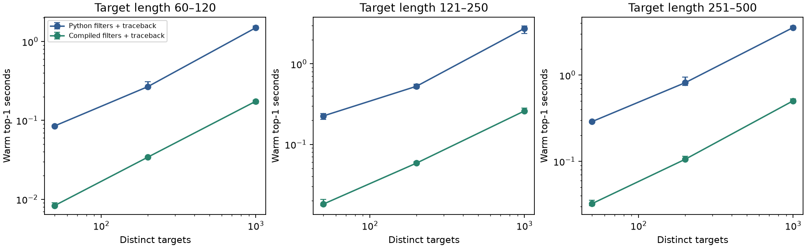

# R3: 같은 검색 결과의 CPU 처리 비용

고정한 10개 query와 실제 구조를 이용해 **10개 크기·길이 조건**을
실행했다. 5개 backend × 전수/필터 × score-only/top-1 × 5회 반복이며 총
**1,000회**의 측정 결과를 검산했다.
같은 검색 모드 내에서 모든 backend의 후보 ID·정렬 점수·top-1 경로가 같았다.

## 고정 조건과 변경한 부분

기존 배포된 seed29 모델·전용 행렬·gap=(14,2)를 그대로 사용했다. R2에서 새로 선택한
모델과 혼동하지 않는다. query는 R1 validation의 고정 10개다. 처리량용 target은 기존
학습·평가 자료와 겹칠 수 있다. 이 실험으로 생물학적 품질 일반화를 주장하지 않는다.
기존 SCOPe40 압축 파일만 읽었다. query PDB, 같은 AA hash, 같은 원본 파일 hash를 제거하고
모든 대상 규모는 고유 구조의 중첩 부분집합으로 구성했다. 중복 복제로 크기를 늘리지 않았다.

길이 구간은 **target 길이**다. 세 구간별 50/200/1,000개와 혼합 60–500의 5,000개를 실행했다.

- 길이 60–120: 5,000개 조건 미실행. 적격 고유 구조 3,514개.
- 길이 121–250: 5,000개 조건 미실행. 적격 고유 구조 4,646개.
- 길이 251–500: 5,000개 조건 미실행. 적격 고유 구조 2,094개.

누적 변경 순서: Python 기준 → Numba double-hit 후보 처리 → 사전 변환된 정수 배열로
Python ungapped 계산 → Numba ungapped 배치 → Numba traceback. 모든 단계는 동일한
exact 3-mer, 동일 대각선의 겹치지 않는 두 hit, window64, ungapped≥20을 유지한다.
정렬의 동점·gap 규칙도 원래 reference와 같다. 300개 무작위/빈 입력/동점 정렬과
35개 반복 문자·무효 mask 후보 사례를 원본 엔진과 별도로 대조했다.

## 실측 결과

각 칸은 5회 중앙값이며 min/max와 score-only, 중간 backend의 값은 JSON에 모두 있다.
backend 효과는 **같은 필터·같은 출력** 비교다. 필터 효과는 최종 backend에서 전수검색을
필터검색으로 바꾼 비율이며, 이때 생기는 검색 손실을 오른쪽에 별도로 표시했다.

| 대상 길이 | 수 | 기준 초 | 최적화 초 | backend 배속 | 전수/필터 배속 | retain@10 |
|---|---:|---:|---:|---:|---:|---:|
| 60–120 | 50 | 0.0852 | 0.0083 | 10.23× | 2.19× | 0.550 |
| 60–120 | 200 | 0.2676 | 0.0341 | 7.84× | 1.98× | 0.730 |
| 60–120 | 1000 | 1.4970 | 0.1750 | 8.56× | 2.00× | 0.810 |
| 121–250 | 50 | 0.2257 | 0.0181 | 12.44× | 1.31× | 0.770 |
| 121–250 | 200 | 0.5267 | 0.0585 | 9.01× | 1.61× | 0.930 |
| 121–250 | 1000 | 2.7591 | 0.2603 | 10.60× | 1.58× | 0.910 |
| 251–500 | 50 | 0.2892 | 0.0324 | 8.93× | 1.25× | 0.850 |
| 251–500 | 200 | 0.8160 | 0.1056 | 7.73× | 1.60× | 0.910 |
| 251–500 | 1000 | 3.5619 | 0.5038 | 7.07× | 1.44× | 0.940 |
| 60–500 | 5000 | 12.5241 | 1.6744 | 7.48× | 1.65× | 0.940 |

서로 다른 규모 [50, 200, 1000, 5000]에서 1.5배 이상이므로 backend 통과 기준은
**True**다. 이 판단은 계산을 바꾼 효과이며 더 민감한
검색 알고리즘을 만들었다는 뜻이 아니다. retain@10이 0.98 미만인 필터를 높은 보존율의
기본 검색으로 채택하지 않는다. production `mini-3di-search`는 수정하지 않고 검증된
실험 커널을 `experiments/followup/system_kernels.py`에 보존했다.

## 시간·메모리의 범위

- 구조 선정 39.1초, 5,010구조 인코딩·파일 저장
  347.8초. 이 비용은 warm 검색 시간에 포함하지 않는다.
- 첫 JIT 호출 1.356초, 기존 전용 cache 파일 0개.
- 검색 반복 sweep 756.6초, 부모 Python peak RSS
  553.4MB.
  프로세스 누적 peak이며 시스템 전체 메모리가 아니다.
- 인덱스 생성·packed 변환·배열 준비·출력 시간을 조건별로 분리했다. score-only와 top-1을
  각각 실제 실행했으며 traceback 시간을 빼서 score-only를 추정하지 않았다.
- backend 순서를 반복마다 회전했고 timed sweep은 직렬 실행했다. 단일 CPU 계산 스레드,
  GPU·클라우드 없음. 로컬 단일 장비의 wall-clock 측정이며 다른 하드웨어 속도를 보장하지 않는다.

후보/점수의 digest를 저장된 순위에서 재구성하고, 저장된 top-1 경로를 독립 재채점했으며
모든 반복의 중앙값·범위를 raw 기록에서 검산했다.
[검증 결과](reports/followup-v2/R3/independent-audit.json).
이 결과만으로 GPU 투입의 이득을 주장하지 않는다. 실제 병목과 별도 전송/JIT 비용을 포함한
예비 측정이 필요하다.

재현: `.venv-research/bin/python -m experiments.followup.system_prepare`, `system_benchmark`,
`report_system`. 원본 입력 경로와 환경은 REPRODUCE.md를 따른다. 이미 있는 출력은 보존하고
별도 OUT 경로를 가진 checkout에서 다시 실행한다.
원본 반복 로그는 `artifacts/followup-v2/R3/benchmark/`다.
