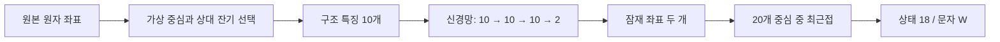

# 2–5회차: 좌표에서 3Di 한 글자까지

**지금은 한 잔기의 좌표를 입력하면 왜 특정 3Di 문자가 나왔는지 중간 계산을 추적할 수 있다.**
이 설명의 숫자는 1UBQ A 사슬, PDB 잔기 번호 2(GLN/Q), 순차 index 1의 실제 실행 결과다.
원본 전체 숫자는 [trace_i001.json](results/day02-05/trace_i001.json)에 있다.



## 2회차 — 원본 좌표를 정확히 읽는다

단백질은 잔기들이 연결된 사슬이고, 각 잔기에는 여러 원자가 있다.
N·CA·C는 주사슬을 이루는 원자다. CB는 보통 곁사슬의 첫 탄소다.
Gly에는 원래 CB가 없으므로, **Gly의 정상적인 CB 부재와 파일에서 빠진 원자를 구분**한다.

이번 잔기의 원본 좌표(Å):

| 원자 | x | y | z |
|---|---:|---:|---:|
| N | 26.335 | 27.770 | 3.258 |
| CA | 26.850 | 29.021 | 3.898 |
| C | 26.100 | 29.253 | 5.202 |
| CB | 26.733 | 30.148 | 2.905 |

1UBQ A 전체의 N/CA/C는 각각 76개, CB는 70개다. 없는 CB 6개는 Gly에 해당한다.
원본에 없는 좌표는 `null`과 `present:false`로 남긴다. 0으로 채우면 가짜 원자가 생긴다.
CB를 계산해 보충하더라도 원본 데이터는 그대로 두고 `cb_used`라는 별도 값으로 기록한다.

PDB 번호와 배열 index도 구분한다. 예를 들어 PDB 번호 7 다음에 7A가 나올 수 있다.
서열 거리 `j-i`는 PDB 번호 차이가 아니라 사슬 안에서의 순차 index 차이다.

코드: [atoms.py](src/mini3di_encoder/atoms.py).
표: [day02_atoms.tsv](results/day02-05/day02_atoms.tsv).
질문: Gly에서 CB가 없을 때 다른 잔기의 CB 결측과 같은 오류로 처리하면 왜 곤란할까?

## 3회차 — 어느 잔기와의 관계를 볼 것인가

3Di는 한 잔기만 고립시켜 보지 않고 **다른 잔기와 이루는 공간적 관계**를 표현한다.
먼저 CA·CB·N의 방향을 이용해 가상의 점을 만든다. 이 점은 실제 원자가 아니다.
공식 구현의 회전각 270도·0도와 거리 배율 2를 사용한다.

이번 잔기의 가상 중심은 약 `(28.021285, 30.923822, 5.919591)`이다.
다른 잔기의 가상 중심까지 거리를 재면 다음과 같다.

| 후보 PDB 번호 | 순차 index | 가상 중심 간 거리(Å) |
|---:|---:|---:|
| **14** | **13** | **1.126341** |
| 3 | 2 | 4.870638 |
| 63 | 62 | 5.015632 |

따라서 잔기 2의 상대는 잔기 14다. 서열에서 바로 옆인 잔기 3보다 가상 중심이 가깝기 때문이다.
CA 간 거리는 6.621238 Å이며 가상 중심 거리는 1.126341 Å다. 서로 다른 점 사이의 거리다.

자기 자신, 사슬 양 끝, 무효 후보를 제외한다. 바로 앞·뒤 잔기라는 이유만으로 제외하지 않는다.
정확한 거리 동점이면 낮은 index를 고른다. 이 규칙은 공식 코드의 순회 순서와 일치한다.
단위 벡터는 방향만 남긴 화살표다. 내적은 두 화살표가 얼마나 같은 방향인지 나타낸다.

Gly 10번에서는 없는 CB를 N/CA/C로 근사했으며 `cb_used ≈ (28.831443,45.454049,14.576109)`였다.
이 좌표는 실험으로 관찰된 원자 좌표라고 표시하지 않는다.

코드: [geometry.py](src/mini3di_encoder/geometry.py).
질문: 가상 중심의 거리와 CA의 거리를 같은 것으로 생각하면 무엇을 잘못 해석할까?

## 4회차 — 관계를 숫자 10개로 요약한다

선택한 두 잔기 i/j와 각각의 앞·뒤 잔기를 사용한다.
u1/u2는 i 주변 주사슬 방향, u3/u4는 j 주변 방향, u5는 i의 CA에서 j의 CA를 향한 방향이다.

| 특징 index | 의미 | 이번 값 |
|---:|---|---:|
| 0 | i 주변 두 방향의 내적 | 0.497426 |
| 1 | j 주변 두 방향의 내적 | 0.480843 |
| 2 | u1과 두 잔기를 잇는 방향 | 0.890847 |
| 3 | u3과 두 잔기를 잇는 방향 | -0.920745 |
| 4 | u1과 u4의 방향 관계 | -0.844818 |
| 5 | u2와 u3의 방향 관계 | -0.788117 |
| 6 | u1과 u3의 방향 관계 | -0.846317 |
| 7 | 두 CA 사이 거리(Å) | 6.621238 |
| 8 | 부호 있는 서열 거리를 -4~4로 제한 | 4 |
| 9 | 부호 있는 서열 거리의 로그 | 2.564949 |

앞의 7개 값은 각도 그 자체가 아니라 단위 벡터의 내적, 즉 각도의 코사인이다.
이 예제는 j-i=13-1=12이므로 특징 8은 4, 특징 9는 ln(13)이다.
상대가 앞쪽이면 마지막 두 특징의 부호가 음수가 된다.

공식 명령의 텍스트 출력은 `SSTR(double)`에서 `{:.3E}`로 반올림한다. 예를 들어 내부 계산의
0.497426...이 출력에는 0.4974가 된다. 내부 계산은 원본 C++의 정밀 출력과 비교하고,
공식 CLI의 숫자는 같은 출력 반올림을 적용해 비교했다. 일치하도록 계산 오차 허용치를 늘리지 않았다.

질문: 특징 순서를 바꾸고 같은 가중치를 쓰면 왜 다른 결과가 나올까?

## 5회차 — 숫자 10개를 문자 하나로 바꾼다

신경망은 숫자들을 가중합하고 상수를 더하는 계산을 반복한다. 중간 두 층에서는 음수를 0으로
바꾸는 ReLU를 적용한다. 마지막 층은 값의 부호를 그대로 남긴다.

| 층 | 입력 → 출력 | 처리 |
|---|---|---|
| 1 | 10 → 10 | 가중합 + bias + ReLU |
| 2 | 10 → 10 | 가중합 + bias + ReLU |
| 3 | 10 → 2 | 가중합 + bias |

공식 가중치 파일은 1,032 bytes이며, 층 정보 등을 제외한 가중치·bias 숫자는 242개다.
직접 학습한 숫자가 아니라 공식 파일에 이미 들어 있는 숫자다.
`.kerasify`의 형식을 직접 읽었고, 실행에는 TensorFlow나 PyTorch가 필요 없다.

이번 잔기는 다음 두 값으로 압축된다.

`[-2.4766321182250977, 0.7266005277633667]`

이것은 실제 공간의 x/y 좌표가 아니라 신경망이 만든 **특징 공간의 좌표**다.
미리 정해진 20개 중심과의 거리를 비교하면 상태 18의 중심 `[-2.3030,0.3813]`이 가장 가깝다.
해당 중심까지의 제곱 거리는 약 0.149381이다. 0부터 세는 상태 번호 18은 문자 **W**에 대응한다.

`GLN/Q의 원자 좌표 → 특징 10개 → 잠재 좌표 2개 → 상태 18 → W`

여기의 W는 아미노산 tryptophan을 뜻하지 않는다. 원래 아미노산은 Q이고, W는 그 위치의
3Di 구조 상태다. 또한 신경망 가중치 행렬은 검색할 때 쓰는 3Di 치환 점수 행렬과 역할이 다르다.

코드: [network.py](src/mini3di_encoder/network.py), [trace.py](src/mini3di_encoder/trace.py).
각 층의 입력·가중합·활성화 출력과 20개 중심까지의 모든 거리는 trace JSON에 있다.

## 검증 범위와 현재 한계

- 잔기 2·10·23·68 네 곳을 비교 전에 선택했다. 각각 W·R·P·Y가 나왔다.
- 이 네 곳의 가상 중심·상대·10개 특징·잠재 좌표·상태는 원본 C++와 일치했다.
- 영벡터·일벡터·기저벡터·고정 난수로 만든 44개 신경망 입력도 원본 C++와 일치했다.
- 첫·마지막 위치는 무효이며 D로 표시된다. 정상 상태 2도 D이므로 `valid`를 함께 봐야 한다.
- 입력 예외, 수식, 모델 파일 오류, 독립 native 출력 비교를 포함한 테스트 42개가 통과했다.
- 이는 한 개발 구조의 일부 위치를 검증한 것이다. 전체 사슬 검증은 6회차, 다양한 구조·일반 입력
  처리·회전/이동 시험·검색 연결은 그 이후다. 재학습이나 검색 성능 개선을 주장하지 않는다.

## 직접 실행

프로젝트 폴더에서:

```bash
source .venv/bin/activate
python -m mini3di_encoder.trace \
  --structure data/raw/1UBQ.pdb --chain A --index 1 \
  --out artifacts/my-residue-2.json
```

`--index 1`은 두 번째 잔기다. 이 명령은 공식 Foldseek를 호출하지 않고 우리 Python 계산과
패키지에 포함한 공식 가중치를 사용한다. `--out`에는 아직 존재하지 않는 파일을 지정한다.
