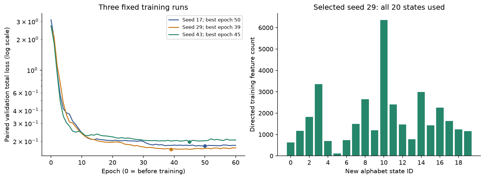
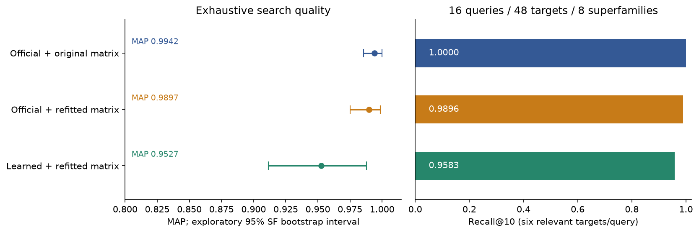
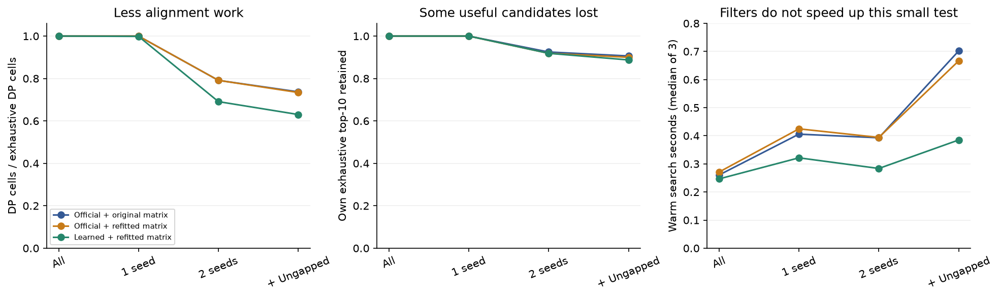

# mini-3di-encoder: 소규모 재학습과 검색 평가

2026-09-29 · `research/sessions-11-15` · 사전 평가 동결 커밋 `cbbef19`

**1–15회차의 범위를 완료했다.** 공식 가중치의 인코더 재현에 이어, 실제 구조에서 대응 특징
쌍을 만들고 작은 VQ-VAE를 학습해 새 알파벳·점수 행렬을 얻었다. 이를 기존 검색 엔진에
연결해 동결한 평가를 실행했다. 재학습 모델은 작동했지만 이 실험에서 공식 모델을 이기지
못했고, 강한 필터는 계산량을 줄여도 전체 시간을 줄이지 못했다. 이는 작은 재현·방법 실험이며
Foldseek 전체 도구나 원 논문의 대규모 성능을 재현했다는 뜻은 아니다.

## 원리를 다시 연결하면

PDB 좌표 → 주변 구조 특징 10개 → 작은 신경망의 좌표 2개 → 가장 가까운 20개 중심 중
하나 → 구조 문자 → 문자열 정렬의 순서다. 1–10회차는 공식 가중치·중심으로 앞부분을 검증했다.
11–15회차는 **서로 대응하는 두 잔기의 특징 X와 Y**를 TM-align으로 찾고, X를 압축한 상태에서
Y를 예측하도록 신경망과 중심을 학습했다. 자기 입력을 복사하는 일반 오토인코더와 구분된다.

새 상태는 공식 상태와 뜻이 다르다. 따라서 학습 구조의 대응 위치에서 함께 나타나는 상태쌍을
세어 새 점수표를 만들었다. 우연히 기대한 것보다 자주 대응하는 상태쌍에는 높은 점수,
드물게 대응하는 쌍에는 낮은 점수를 준다. 이 새 점수표로 전수검색을 먼저 하고, 필터를 켰을 때
원래 찾던 대상이 얼마나 빠지는지 따로 확인했다.

## 데이터와 분리

| 항목 | 실제 사용 |
|---|---|
| 원본 | 저자 공개 SCOPe 2.01/SCOPe40 PDB 묶음, 고정 분류표 |
| 전체 선정 | 384도메인, 58,410잔기, 48 superfamily / 48 fold |
| train | 256도메인, 32 superfamily; a/b/c/d 각 8그룹 |
| validation | 64도메인, 8 superfamily; 16 query × 48 target |
| test | 64도메인, 8 superfamily; 16 query × 48 target |
| 양성 정의 | query와 같은 SCOPe superfamily인 target, query당 6개 |
| 적격성 | 단일 사슬, 60–250잔기, N/Cα/C 완비, C–N 연결 유효 비율 ≥95% |
| 이전 데이터 제외 | 과거 search pilot/D2와 1UBQ의 domain 및 PDB 전체 제외 |
| split 간 겹침 | fold/SF/PDB/AA hash/구조 hash/CA 거리 지문 모두 0 |

원본 후보 11,211개 중 적격 6,849개에서 고정 hash 순서·클래스 균형으로 선정했다. 길이로
2,145개, 이전 domain/PDB로 1,187개, 지원 분류 밖 1,029개, 과도한 단절 1개를 제외했다.
CA 지문은 순서가 있는 Cα 간 거리를 0.01Å 단위로 반올림한 hash다. 모든 근접 구조나
서열 유사성을 제거하는 방법은 아니다. 선정 목록과 구조 SHA는 [동결 manifest](experiments/frozen/manifest.json)에 있다.

**중요한 한계:** test 64개 중 40개는 공식 공개 training SID 목록, 24개는 공식 공개 validation
목록에 포함된다. 우리 모델에서는 fold를 분리했지만 공식 모델에 대해서는 독립 비노출 평가라고
부를 수 없다. 이 목록만으로 배포 가중치의 모든 학습 이력을 확정할 수도 없다.
또 이번 음성 target은 모두 다른 fold다. 같은 fold의 다른 superfamily라는 어려운 음성이 없다.

## 학습 쌍과 모델

train/validation 내부 같은 superfamily에서 그룹당 최대 12쌍을 결과와 무관한 hash로 골랐다.
TM-align의 양쪽 길이로 정규화한 두 점수 중 최솟값 ≥0.6인 구조 쌍에서 거리 5Å 미만 `:` 위치를
사용했다. 양쪽 위치가 엄격한 검색용 mask를 통과해야 한다. 방향을 뒤집은 Y→X도 포함한다.

| 분할 | 시도한 구조 쌍 | 통과한 쌍 | 통과 SF | 양방향 특징 쌍 |
|---|---:|---:|---:|---:|
| train | 384 | 152 | 31/32 | 35,554 |
| validation | 96 | 64 | 8/8 | 17,826 |

실제 통과 쌍에 참여한 고유 구조는 train 164/256개, validation 51/64개다.
test 구조로 학습 대응 쌍을 만들지 않았다. train의 한 SF에서는 기준을 통과한 쌍이 없었다.
제외 목록을 숨기거나 결과를 본 뒤 다른 쌍으로 교체하지 않았다. TM-align 원본 문자열과 잔기
index 대응, AA 전체 문자열을 대조했다. 양방향 예제는 서로 독립된 표본 2개로 해석하지 않는다.

모델은 공개 학습 소스의 10→10→10→2 encoder, BatchNorm/ReLU, 20×2 codebook,
Gaussian decoder 구조를 재구현했다. 손실은 대응 특징 Y의 Gaussian NLL + codebook MSE +
0.25×commitment MSE다. 원본의 `exp(0.5*logvar)`를 그대로 variance 인자로 쓰는 규칙도 유지했다.
CPU 계산 스레드 1개, Adam 0.001, batch 512, 60epoch, seed 17/29/43으로 고정했다.
원본의 데이터 규모·seed 탐색·학습 스케줄 전체를 재현한 것은 아니다.

| seed | 선택 epoch | 최소 validation 전체 손실 | train 상태 사용 | 학습·검증·export 시간 |
|---|---:|---:|---:|---:|
| 17 | 50 | 0.179872 | 20/20 | 3.803초 |
| **29** | **39** | **0.166749** | **20/20** | **3.968초** |
| 43 | 45 | 0.198050 | 20/20 | 3.525초 |

validation loss로 seed 29/epoch 39를 골랐다. test를 보고 고르지 않았다. 20상태 사용은
완전한 상태 붕괴가 없다는 관측이며 검색 품질의 보장이 아니다. 선택한 모델의 train 상태
perplexity는 15.825다. test 검색은 이 선택 모델 한 개의 결과이며 seed 평균 성능이 아니다.

## 점수표와 비교 조건

학습 대응 상태 빈도 C를 대칭으로 세어 `P(a,b)=(C(a,b)+0.5)/(ΣC+200)`으로 평활화했다.
주변 확률 p에서 `round(2 log2(P(a,b)/(p(a)p(b))))`를 구한다. round는 ties-to-even이고
X 행·열은 0이다. 공식 추정 코드와 달리 작은 표본용 평활화를 넣고 무효 상태를 정상 상태에
병합하지 않는다. 두 재추정 행렬 모두 **train의 35,554 대응만** 사용했다.

| 비교군 | 표현 | 점수 행렬 | validation에서 고른 gap open/extend |
|---|---|---|---|
| official_original | 공식 가중치/중심 | 공식 행렬 | 10 / 1 |
| official_refit | 공식 가중치/중심 | train에서 새로 추정 | 14 / 2 |
| learned_refit | 새 가중치/중심 | 같은 추정법의 전용 행렬 | 14 / 2 |

gap 후보는 사전에 (6,1), (10,1), (14,2)로 고정하고 validation MAP로 선택했다. 원 모델과
새 모델의 비교에는 표현·행렬·선택 gap이 함께 달라진다. 특히 original과의 차이를 표현 하나의
인과 효과라고 단정하지 않는다. official_refit과 learned_refit은 같은 gap·추정법이다.

모든 비교군은 **같은 mini-3di-search 엔진**으로 검색했다. `official_original`도 공식 Foldseek
실행 파일의 결과가 아니다. 공식 도구 전체와의 속도 배수를 주장하지 않는다.

## 동결된 최종 검색 결과

MAP는 관련 target이 얼마나 위에 모이는지 평가하며, 빠진 관련 target도 분모 6에 포함한다.
동점은 raw score 내림차순·ID 오름차순으로 처리하고 동점 순서 기대 MAP도 별도로 보고한다.
Recall@10의 총 양성 분모는 16×6=96이다. Recall@1은 최대 1/6이므로 관련 대상 1위 비율과 다르다.

| 전수검색 비교군 | MAP | 동점 기대 MAP | Recall@10 | 관련 대상 1위 |
|---|---:|---:|---:|---:|
| 공식+공식 행렬 | 0.994172 | 0.993614 | 96/96 = 1.0000 | 16/16 |
| 공식+재추정 행렬 | 0.989679 | 0.990442 | 95/96 = 0.9896 | 16/16 |
| 재학습+재추정 행렬 | 0.952735 | 0.952598 | 92/96 = 0.9583 | 16/16 |

SF 단위 2,000회 bootstrap의 재학습−공식 MAP 차이는 −0.04144, 탐색적 95% 구간은
[−0.08460, −0.00424]다. 재학습−공식 재추정은 −0.03694 [−0.07862, −0.00047]이다.
8그룹뿐이며 학습 모델을 고정한 bootstrap이다. 학습 seed 불확실성·공식 학습 노출·분류 편향을
포함하지 않으므로 일반적인 통계적 우월성/열등성 확정으로 확대하지 않는다.

필터는 연속 exact 3-mer, 같은 대각선의 겹치지 않는 두 seed 간격 3–64, ungapped threshold 20이다.
`보존`은 **각 비교군 자체의 전수검색 top-10** 후보 보존율이다. 생물학적 양성 회수율과 다르다.
시간은 3회 반복 중앙값, warm Numba 점수 계산 + query당 top-1 Python 상세 정렬/재채점이다.
모든 양수 점수의 순위는 저장하며 top-1만 상세 경로를 만든다. 인코딩·JIT·파일 입출력은 제외했다.
표의 DP cell은 **점수 계산용**이며, top-1 경로 복원을 위한 추가 DP는 별도로 수행한다.

| 비교군 | 필터 | 정렬 쌍 / 768 | DP cell | top-10 보존 / 160 | MAP | 검색 초 |
|---|---|---:|---:|---:|---:|---:|
| 공식+공식 | 없음 | 768 | 19,614,969 | 160 | .9942 | .2604 |
| 공식+공식 | single | 768 | 19,614,969 | 160 | .9942 | .4058 |
| 공식+공식 | double | 574 | 15,520,964 | 148 | .9213 | .3928 |
| 공식+공식 | double+ungapped | 534 | 14,458,205 | 145 | .9213 | .7020 |
| 공식+재추정 | 없음 | 768 | 19,614,969 | 160 | .9897 | .2709 |
| 공식+재추정 | single | 768 | 19,614,969 | 160 | .9897 | .4247 |
| 공식+재추정 | double | 574 | 15,520,964 | 147 | .9168 | .3941 |
| 공식+재추정 | double+ungapped | 533 | 14,396,354 | 144 | .9172 | .6665 |
| 재학습+재추정 | 없음 | 768 | 19,614,969 | 160 | .9527 | .2466 |
| 재학습+재추정 | single | 767 | 19,586,199 | 160 | .9527 | .3215 |
| 재학습+재추정 | double | 509 | 13,553,326 | 147 | .9019 | .2836 |
| 재학습+재추정 | double+ungapped | 459 | 12,360,286 | 142 | .8949 | .3850 |

재학습의 강한 필터는 정렬 쌍을 40.2%, DP cell을 37.0% 줄였으나 총시간은 약 1.56배가 됐다.
SW 점수 계산은 .0583→.0337초였지만 후보 .0720초, ungapped .0903초가 추가됐고
Python 상세 정렬은 약 .186초였다. 작은 DB에서 후보·필터 처리 비용이 절약보다 컸다.
단일 exact seed는 거의 모든 대상을 통과시켰다. 이 범위에서는 필터를 속도 개선으로 권할 근거가 없다.

## 실제 실패 사례

- `d3heib_`(b.6.1, 132잔기): 재학습 전수검색에서 양성 두 개가 12위와 16위다. AP .7653.
  모든 대상이 정렬됐으므로 필터 때문이 아니다. 표현·행렬·gap의 순위 문제를 구분해 조사할 사례다.
- `d1vq8a1`(b.34.5, 147잔기): 재학습 전수검색 AP 1.0 → double .5 → ungapped 추가 .3333.
  double 단계에서 관련 대상 3개를 놓쳤고, 추가 필터에서 `d2do3a1`의 ungapped 점수 14가
  threshold 20에 못 미쳐 더 빠졌다. 6개 양성 중 2개만 후보에 남았다. 시험 결과를 보고 threshold를 낮추지 않았다.
- `d1q77a_`(c.26.2): 관련 대상 `d1efva1`가 전수검색 33위다. 필터가 일부 음성을 빼면서 AP가
  .7896→.7915로 조금 오른다. 필터 후 MAP 상승만으로 표현이나 정렬이 개선됐다고 볼 수 없다.

모든 query의 관련 대상 순위·후보 누락은 [독립 audit](reports/sessions-11-15/independent-audit.json)에 있다.
표본 수, 짧은 입력, 다양한 학습 쌍 부족 등이 원인 후보지만 현재 실험으로 원인을 확정하지 않는다.

## 검증과 재현 결과

- pinned 공식 학습 소스와 자체 모델의 순전파·손실·parameter gradient가 같은 입력에서 일치했다.
- BatchNorm을 접어 NumPy 모델로 export했다. 전체 384구조의 유효 특징 **57,642개에서 상태 차이 0**,
  잠재 좌표 최대 오차 1.19e−6이었다. 그중 test 구조 64개의 전체 사슬 API 경로도 별도로 대조했다.
- 원본 TM-align 출력 480개를 다른 parsing 루프로 다시 읽고, 35,554/17,826개 학습·검증 쌍을 복원했다.
  행렬 800개 유효 cell을 scalar log-odds로 재계산했다. test/validation은 행렬 빈도에 쓰지 않았다.
- 36회 검색의 모든 저장 점수·AP·Recall·보존율을 별도 루프로 검산했다. 유지된 쌍의 전수검색 점수
  불일치 0. 실제 target posting 7,204개씩과 공식/재학습 hit 64,479/32,362개에 무효 seed 0.
- 새 폴더에서 구조 추출·특징·정렬·학습·행렬을 다시 실행했다. 384개 특징 배열, 480개 정렬,
  세 모델의 숫자, 183개 epoch의 train/validation 지표, 세 행렬이 일치했다. 같은 컴퓨터/버전에서의 검증이다.
- 최종 pytest: 연구 환경 **58 passed**, NumPy 기본 환경 **55 passed, 1 skipped**(PyTorch 전용 모듈).
  Ruff check/format 통과. 기본 공식 가중치·중심·geometry/network 소스는 시작점과 동일하다.
- 별도 가상환경에 wheel을 설치하고 NumPy만으로 공식/재학습 1UBQ CLI를 실행했다.
  각각 76위치/74유효가 소스 실행과 같고 출력 덮어쓰기를 거부했다. NumPy는 기존 설치에서
  복사한 offline 설치 검증이며 새 의존성 다운로드 검증은 아니다. 검색 CLI도 768점수·16상세
  정렬이 API 전수검색 결과와 같았다.

독립 audit도 좌표 parser와 학습 모델 클래스는 공유한다. 모든 과정을 완전히 독립된 두 프로그램으로
재구현했다는 뜻은 아니다. 공식 좌표/3Di 일치는 앞선 [6–10회차](PLAN_06_10.md)의 13구조 검증이다.
이번 384개 모두를 공식 binary와 다시 비교한 것은 아니다.

## 컴퓨터 자원과 재현 파일

macOS 27.0.1 arm64, Python 3.12.14, 논리 CPU 18개 환경에서 **계산 스레드 1개**, GPU/클라우드 0으로 실행했다.
CPU 상품명·설치 RAM 조회는 sandbox에서 거부되어 추측하지 않았다. 아래 RAM은 OS가 기록한
해당 Python 프로세스의 누적 peak RSS이며 컴퓨터 전체 메모리나 단계별 추가 할당량이 아니다.

| 구간 | 측정값 | 범위 |
|---|---:|---|
| 384구조 공식 특징 계산 | 25.64초 | encode 함수 합, PDB 읽기/정렬 제외 |
| TM-align 480회 | 13.55초 | subprocess 실행 시간 합 |
| 세 학습 run | 11.30초 | 60epoch×3, validation/export 포함, import 제외 |
| 특징/정렬 수집 프로세스 peak | 77.1MB | child TM-align 메모리와 합산하지 않음 |
| 학습 프로세스 peak | 325.6MB | PyTorch 포함 |
| 검색 평가 프로세스 peak | 143.5MB | 전체 반복 평가의 누적 peak |
| test64개 전체 인코딩 | 공식/재학습 모두 약 5초 | 각 3회, 같은 좌표·함수·CPU, 파싱/출력 제외 |
| 새 연구 Python 환경 | 약 1.06GB | 설치된 파일 논리 크기, 실제 계산 RAM과 별개 |
| 기존 구조 압축 묶음 | 306.1MB | 기존 파일 재사용, 신규 대규모 다운로드 없음 |

64개 인코딩 벤치마크의 정확한 중앙값·반복값·peak RSS는
[encoding-benchmark.json](reports/sessions-11-15/encoding-benchmark.json), 디스크 크기는
[resources.json](reports/sessions-11-15/resources.json)에 있다. 공식 상태 cache와 재학습 forward를
비교한 시간을 속도 비교로 쓰지 않고, 양쪽 모두 전체 기하 계산을 다시 했다. 첫 측정 시도는
시스템 정보 조회 실패 및 audit 동시 실행 때문에 제외한 사실을 artifacts에 남겼다.

위 시간을 합쳐 전체 프로젝트 소요 시간이라고 부르지 않는다. 데이터 후보 조사·다운로드·의존성
설치·개발·컴파일·검토는 별도다. 인코더가 자세한 중간 계산을 만드는 학습용 구현이고 구조 길이도
250까지 제한되어 있으므로, 임의의 긴 구조나 대규모 DB에 같은 자원 수치를 적용할 수 없다.

## 사용 가능한 완성물과 다음 단계

- [배포 모델·전용 행렬](models/paired-vqvae-small/README.md): 추가 PyTorch 없이 NumPy로 실행.
- [재현 명령](REPRODUCE.md), [실행 계획/완료표](PLAN_11_15.md), [기계 판독 결과표](reports/sessions-11-15/search-results.tsv).
- [후속 연구 계획](NEXT_RESEARCH.md): 어려운 평가 데이터 → 학습량/경계 안정성 → 후보 처리·상세 정렬 최적화.
  가설·분리 기준·측정값·자원 상한·중단 기준을 적었다. 후속 연구 실험은 이번에 실행하지 않았다.

원본 실행은 `artifacts/sessions-11-15`, 재생성은 `artifacts/sessions-11-15-replay`에 있다.
큰 입력·checkpoint·실행 로그는 로컬 보관하며 Git에는 코드·고정 목록·작은 배포 모델·결과표/그림만 둔다.
배포 모델을 공식 3Di와 같은 상태 체계라고 부르지 않고, raw score를 E-value·TM-score·상동성 확률로 표시하지 않는다.

## 출처

- [Foldseek 논문](https://doi.org/10.1038/s41587-023-01773-0),
  [공식 구현 941cd33](https://github.com/steineggerlab/foldseek/tree/941cd33ff0771cd2e3f144e3293e22a2b87e9fda).
- [학습 소스 654100b](https://github.com/steineggerlab/foldseek-analysis/tree/654100b11242e581f9e6d43798b07a778903862e/training):
  paired feature 목표·구조·손실·상태쌍 행렬 추정의 기준. 학습 방법·데이터 규모의 차이는 위에 명시했다.
- [TM-align 소스 1fa25a9](https://github.com/pylelab/USalign/tree/1fa25a958fe3095900eba2ef9b48562bdc462251),
  실행 파일 version 표시 20240303. 소스 revision과 표시 버전을 함께 고정했다.
- [source-lock](experiments/source-lock.json): 원본 URL·파일 SHA-256·크기.
  공식 Foldseek GPL 라이선스는 저장소에, TM-align 라이선스는 받은 소스 묶음에 보존했다.
